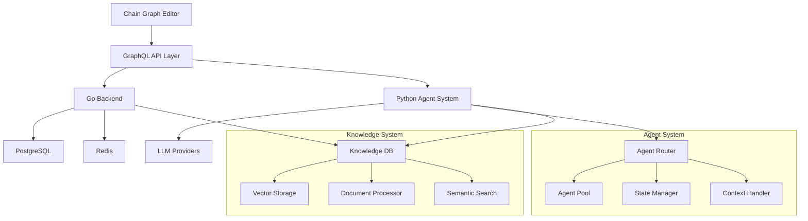

# Bad AI Platform

## Introduction

Bad AI is an enterprise-grade platform for creating, deploying, and orchestrating AI agents through visual composing and Chain Graph technology. The platform enables complex multi-agent interactions, knowledge sharing, and sophisticated AI behavior development through a visual programming environment while maintaining technical rigor and system reliability.

The platform combines several key technological innovations:
- Chain Graph system for visual AI behavior programming
- Knowledge Database with vector-based semantic processing
- Multi-agent orchestration system
- Enterprise-grade execution engine

## Documentation Index

### Overview
- [Project Overview](docs/project_overview.md) - Complete platform overview and capabilities
- [Introduction](docs/01_introduction.md) - Platform introduction and core concepts

### Architecture
- [System Architecture Overview](docs/02_architecture/overview.md) - Detailed system architecture and components

### Chain Graph System
- [Chain Graph Overview](docs/03_chain_graph/overview.md) - Introduction to Chain Graph technology
- [Execution System](docs/03_chain_graph/execution.md) - Chain Graph execution architecture
- [Handle System](docs/03_chain_graph/handles.md) - Type system and data flow
- [Node System](docs/03_chain_graph/nodes.md) - Node types and capabilities
- [Design Patterns](docs/03_chain_graph/patterns.md) - Common patterns and best practices

### Knowledge Database
- [KDB Overview](docs/04_kdb/overview.md) - Knowledge Database system overview
- [Vector Processing](docs/04_kdb/vector_processing.md) - Vector operations and semantic search

## System Capabilities

### Multi-Agent Operations
- Complex agent interactions
- Knowledge sharing
- Task coordination
- Context management
- Intelligent message routing

### Knowledge Processing
- Vector-based semantic search
- Document processing
- Context management
- Knowledge graph construction

### Enterprise Features
- Production-ready deployment
- Security and access control
- Performance monitoring
- Resource management
- Integration capabilities

## Technical Stack

- Backend: Go
- Agent System: Python
- API: GraphQL with WebSocket support
- Databases:
    - PostgreSQL with vector operations
    - Redis for caching
- Vector Processing: HNSW index

## Architecture Overview

## Quick Links

### Development
- [Architecture Documentation](docs/02_architecture/overview.md)
- [Chain Graph Documentation](docs/03_chain_graph/overview.md)
- [Knowledge Database Documentation](docs/04_kdb/overview.md)

### Technical Resources
- [Execution Patterns](docs/03_chain_graph/patterns.md)
- [Vector Processing](docs/04_kdb/vector_processing.md)
- [Node System](docs/03_chain_graph/nodes.md)

## Current Status

The platform has reached production readiness with:
- Fully implemented backend system
- Operational agent execution system
- Production-ready database system
- Multiple deployed integrations
- Active monitoring and management capabilities

[System Overview]
> "Bad AI combines visual programming simplicity with technical sophistication, enabling the development of complex AI systems through its Chain Graph technology and Knowledge Database while maintaining enterprise-grade reliability and performance."

[Technical Foundation]
> "The platform's architecture enables sophisticated multi-agent operations through its Chain Graph system, Knowledge Database, and intelligent routing mechanisms, all built on proven technologies and mathematical foundations."

## Documentation Structure

The documentation is organized to provide both high-level understanding and detailed technical information:

1. **Overview Documents** - Platform introduction and general concepts
2. **Architecture Documents** - System design and component interaction
3. **Technical Documents** - Detailed component documentation
4. **Implementation Guides** - Specific system aspects and features

Each section provides progressively more detailed technical information while maintaining clarity and practical applicability.