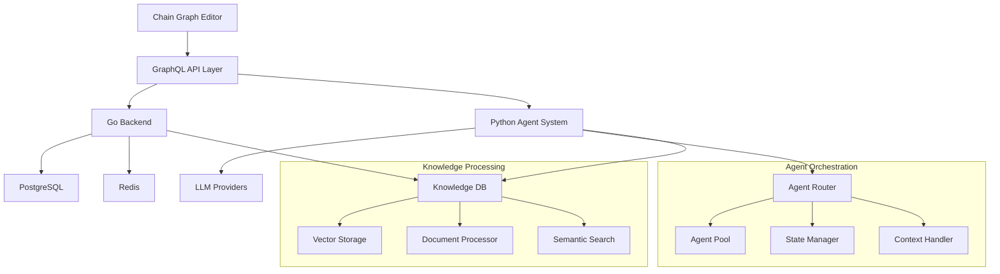
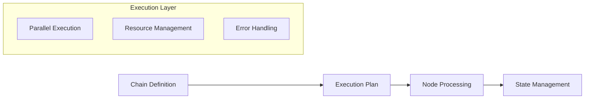
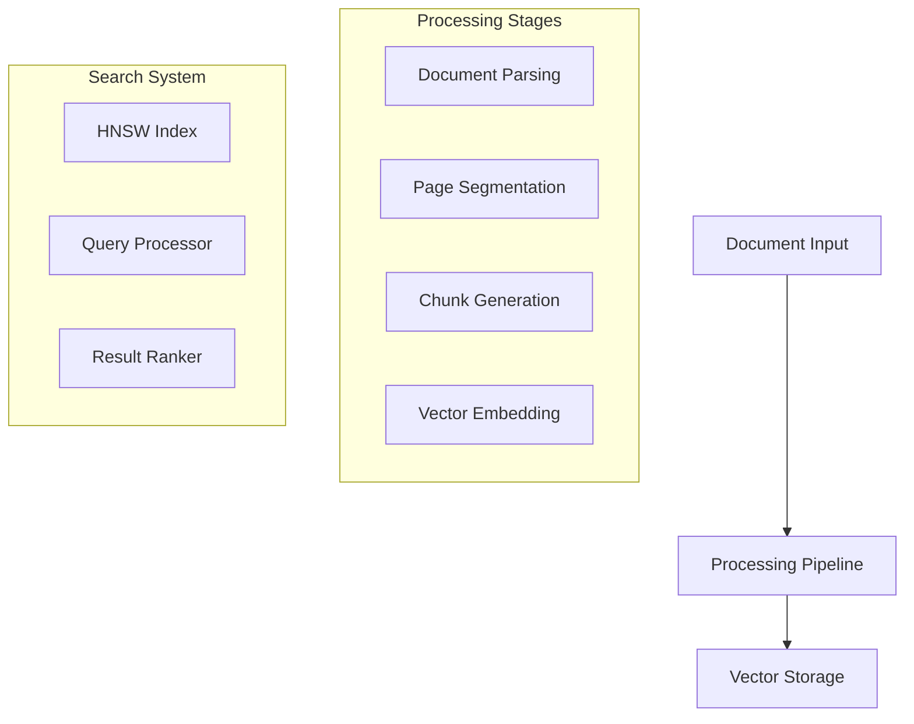
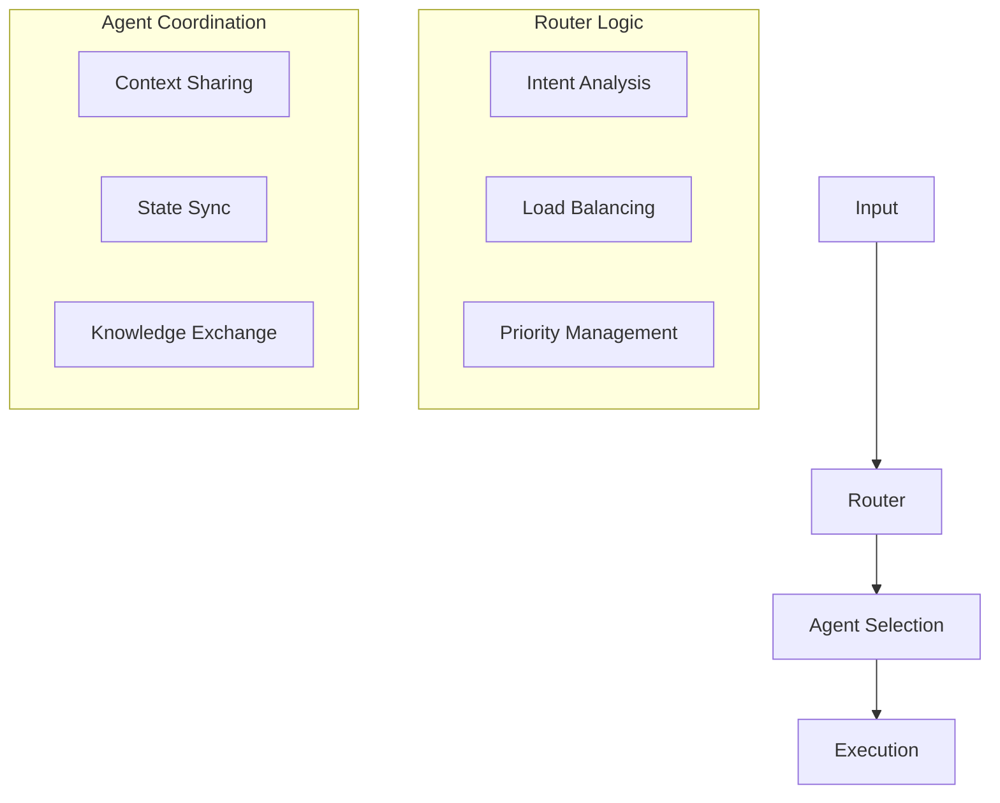
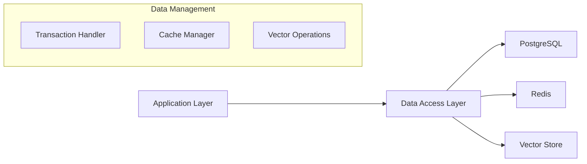
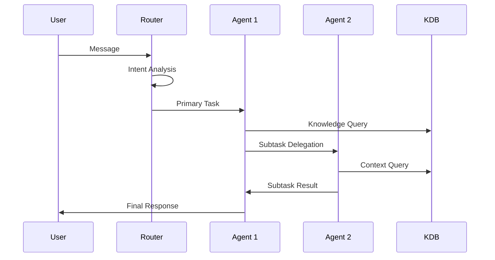
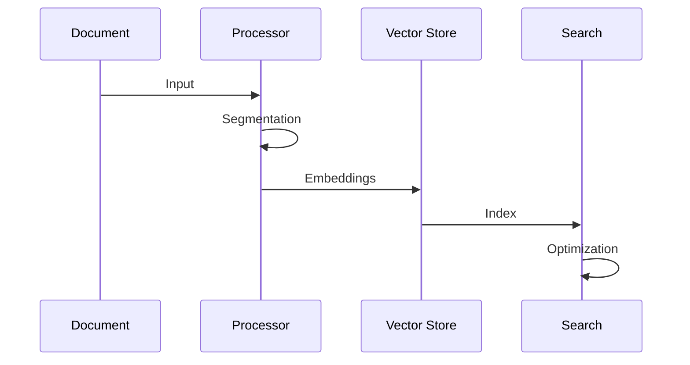

# System Architecture

## Architectural Overview

Bad AI implements a distributed architecture designed around multi-agent orchestration and knowledge processing. The system's architecture enables complex agent interactions, knowledge sharing, and scalable processing through several specialized subsystems.

## System Components

## Core Subsystems

### 1. Chain Graph System
The Chain Graph system provides the foundation for agent behavior definition and execution:

Components:
- Graph Compiler
- Execution Planner
- Node Scheduler
- State Manager
- Resource Controller

### 2. Knowledge Database System

The KDB implements a hierarchical knowledge processing architecture:

Features:
- Document Processing Pipeline
- Vector Operations System
- Semantic Search Engine
- Knowledge Graph Builder
- Context Management

### 3. Agent Orchestration System

The multi-agent orchestration system manages agent interactions and task distribution:

Components:
- Message Router
- Agent Manager
- Context Controller
- State Synchronizer
- Resource Allocator

### 4. Data Layer Architecture

The data layer implements a multi-tiered storage system:

Features:
- ACID Compliance
- Vector Operations
- Real-time State Management
- Cache Optimization
- Sharding Support

## Communication Patterns

### 1. Agent Interaction Flow

### 2. Knowledge Processing Flow

## System Integration

### 1. External Integrations
- LLM Provider Integration
- Platform Connectors
- Webhook System
- Custom API Integration

### 2. Internal Communication
- GraphQL API
- WebSocket System
- Message Queue
- State Synchronization

## Scalability Architecture

The system implements several scalability patterns:

### 1. Horizontal Scaling
- API Layer Scaling
- Agent Pool Management
- Database Sharding
- Cache Distribution

### 2. Resource Management
- Load Balancing
- Resource Allocation
- Cost Optimization
- Performance Monitoring

## Fault Tolerance Design

The system implements multiple reliability patterns:

### 1. Error Handling
- Graceful Degradation
- Automatic Retry
- Circuit Breaking
- Error Recovery

### 2. State Management
- Transaction Safety
- State Persistence
- Recovery Procedures
- Consistency Maintenance

## Performance Optimization

### 1. Query Optimization
- Vector Search Optimization
- Cache Strategy
- Query Planning
- Result Caching

### 2. Resource Utilization
- Parallel Processing
- Resource Pooling
- Load Distribution
- Cost Management

[Architecture Quote]
> "The system's multi-tiered architecture enables complex agent interactions while maintaining data consistency and processing efficiency through specialized subsystems for knowledge management and agent orchestration."

[Technical Note]
> "Each subsystem implements specific optimization strategies, from HNSW indexing in the Knowledge Database to dynamic routing in the Agent Orchestration System."

[Implementation Insight]
> "The integration of Chain Graph execution with the Knowledge Database enables agents to share context and knowledge while maintaining independent processing capabilities."