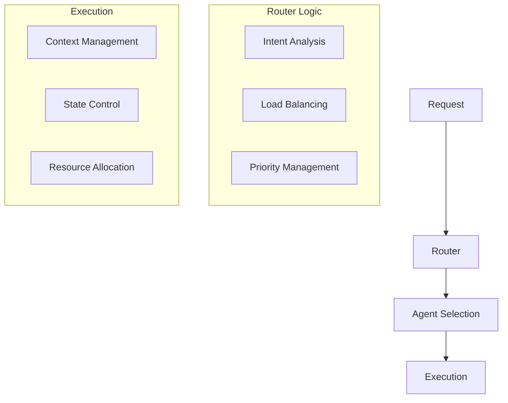
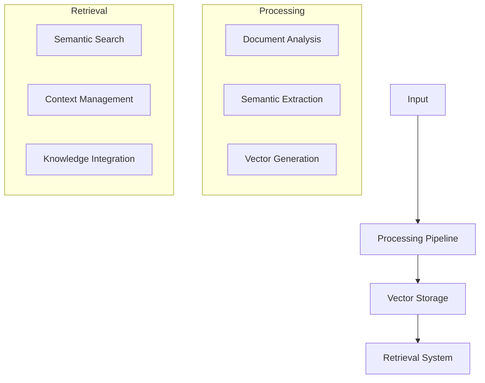
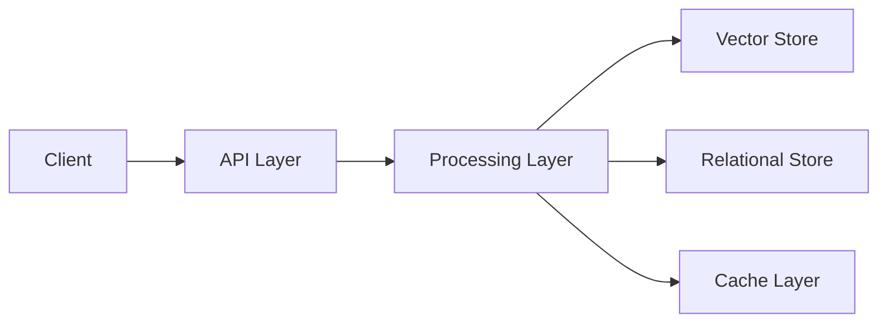

# System Architecture Overview

## Core Architecture Philosophy

Bad AI implements a distributed, enterprise-grade architecture designed around three fundamental principles:
1. Multi-agent orchestration with mathematical guarantees
2. Knowledge-centric processing with semantic understanding
3. Visual programming with formal verification

This architectural approach enables complex AI behaviors while maintaining system reliability and performance at scale.

## System Layers

### 1. Presentation Layer: Chain Graph Editor

The Chain Graph Editor provides a visual programming environment that transforms complex AI behavior design into an intuitive yet powerful process:

- **Visual Programming Interface**
    - Component-based design
    - Real-time validation
    - Type-safe connections
    - Visual debugging tools

- **Development Features**
    - Real-time preview
    - Component library
    - Pattern templates

### 2. API Layer: GraphQL with WebSocket

The API layer implements a modern, real-time capable interface:

- **GraphQL API**
    - Type-safe operations
    - Efficient data retrieval
    - Batch operations
    - Query optimization

- **WebSocket Integration**
    - Real-time updates
    - Bi-directional communication
    - Stream processing
    - State synchronization

### 3. Core Processing Layer

The core layer consists of two primary systems:

#### Go Backend
Handles system operations and coordination:
- Request processing
- Resource management
- State coordination
- Security enforcement
- Performance monitoring

#### Python Agent System
Manages AI operations and agent behavior:
- Agent execution
- LLM integration
- Knowledge processing
- Context management

### 4. Knowledge Layer

The Knowledge Database (KDB) provides sophisticated semantic processing:

- **Vector Operations**
    - Semantic similarity search
    - Context-aware retrieval
    - Dynamic knowledge updates
    - Efficient indexing

- **Knowledge Processing**
    - Document analysis
    - Semantic understanding
    - Context management
    - Knowledge graph construction

## System Components

### 1. Agent Orchestration System

The orchestration system manages:
- Agent coordination
- Resource allocation
- State management
- Load balancing
- Error handling

### 2. Knowledge Processing System

Features:
- Advanced semantic processing
- Efficient vector operations
- Context-aware retrieval
- Dynamic knowledge updates

### 3. Execution Engine

The execution engine provides:
- Parallel processing capabilities
- Resource optimization
- State management
- Error boundaries
- Performance monitoring

## Data Architecture

### 1. Storage Systems

The platform utilizes specialized storage systems:

- **PostgreSQL with Vector Operations**
    - ACID compliance
    - Vector indexing
    - Transaction safety
    - Complex queries

- **Redis Cache Layer**
    - High-performance caching
    - Real-time operations
    - State management
    - Session handling

### 2. Data Flow

Key features:
- Type-safe data flow
- Efficient routing
- Cache optimization
- Transaction management

## Security Architecture

### 1. Authentication & Authorization
- Role-based access control
- Session management
- Token validation
- Permission enforcement

### 2. Data Security
- End-to-end encryption
- Secure storage
- Access logging
- Audit trails

## Scalability Architecture

### 1. Horizontal Scaling
The system supports horizontal scaling at multiple levels:
- API layer scaling
- Processing node expansion
- Storage sharding
- Cache distribution

### 2. Resource Management
Sophisticated resource management ensures optimal performance:
- Dynamic allocation
- Load balancing
- Cost optimization
- Resource monitoring

## Deployment Architecture

### 1. Container Orchestration
- Kubernetes support
- Docker containers
- Service mesh
- Auto-scaling

### 2. Monitoring System
Comprehensive monitoring includes:
- Performance metrics
- Resource utilization
- Error tracking
- Cost analysis

## System Integration

### 1. External Integration
The system provides multiple integration points:
- REST APIs
- WebSocket endpoints
- Webhook system
- Event streams

### 2. Internal Communication
Internal components communicate via:
- GraphQL API
- Message queues
- State synchronization
- Event broadcasting

## Operational Features

### 1. Monitoring & Management
- Real-time monitoring
- Performance analytics
- Resource tracking
- Cost management

### 2. Maintenance & Updates
- Zero-downtime updates
- Rolling deployments
- State migration
- Version management

[Architecture Note]
> "The system's multi-layered architecture enables complex AI operations while maintaining reliability and performance through mathematical guarantees and formal verification."

[Technical Note]
> "Each component is designed for both independence and seamless integration, enabling flexible scaling while maintaining system integrity."

[Operational Note]
> "The architecture supports enterprise-grade operations through comprehensive monitoring, security, and maintenance capabilities."