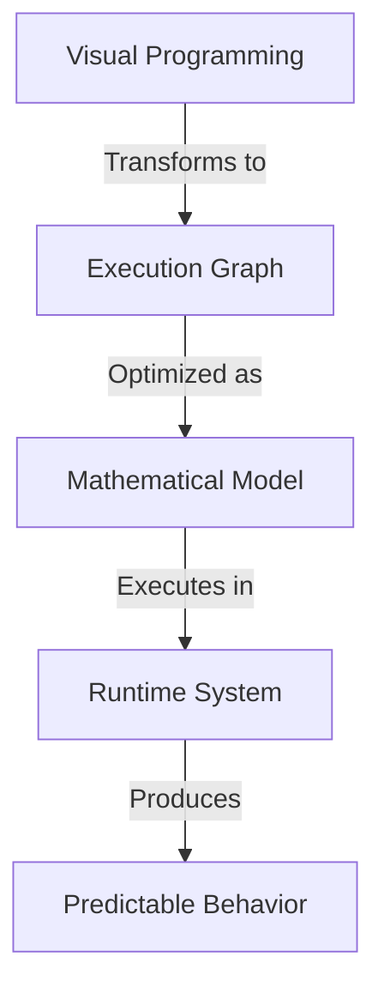
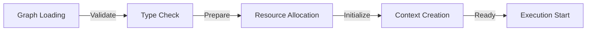
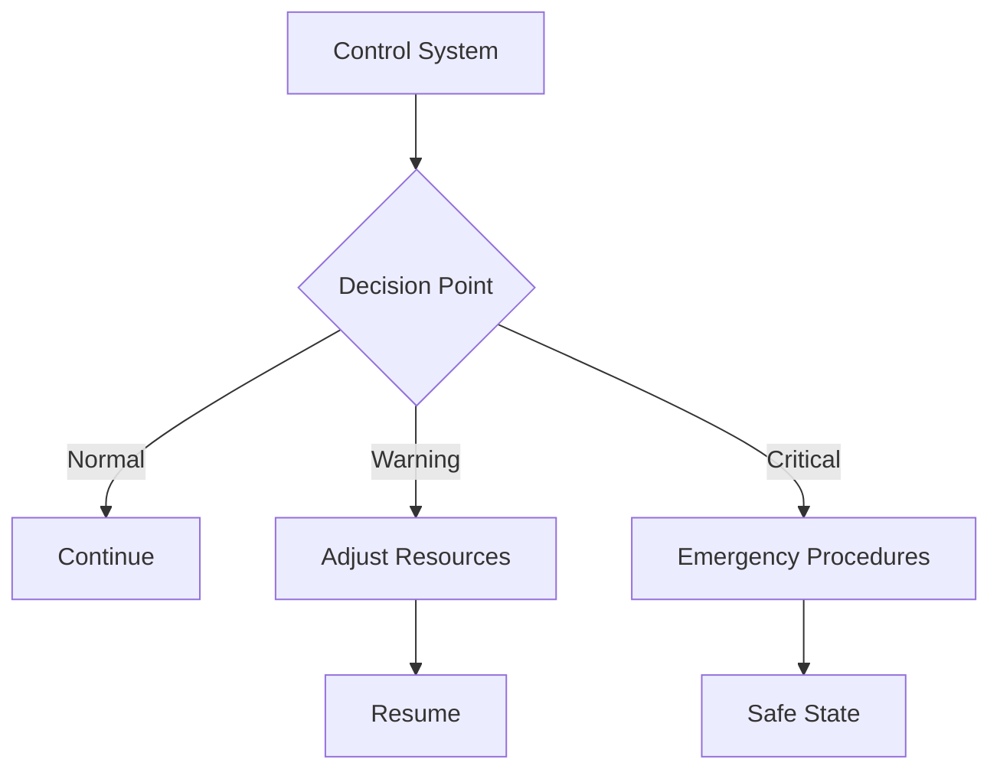
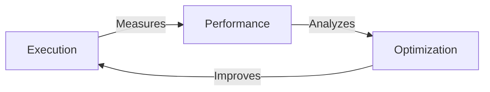

# Chain Graph: Execution System

## The Power of Visual Programming Meets Enterprise AI

The Chain Graph execution system represents a fundamental breakthrough in how AI agents operate. By combining the intuitive nature of visual programming with the rigor of mathematical formalism, we've created a system that's both powerful and predictable.

## Core Innovation

### The Execution Model

At its heart, Chain Graph implements a hybrid execution model that marries the best aspects of three paradigms:
- Dataflow Programming
- Functional Composition
- Actor Model

This unique combination allows us to achieve what traditional chatbot platforms cannot: deterministic, scalable, and mathematically verifiable AI agent behaviors.



### From Visual to Executable

When a user creates an agent in our visual editor, the system performs a series of sophisticated transformations:

1. **Graph Analysis Phase**
    - Topological sorting of nodes
    - Dependency resolution
    - Cycle detection and validation
    - Resource requirement calculation
    - Type system verification

2. **Optimization Phase**
    - Parallel execution paths identification
    - Memory usage optimization
    - Token consumption prediction
    - Cost optimization strategies
    - Performance bottleneck detection

3. **Execution Planning**
    - Resource allocation strategy
    - Execution schedule generation
    - Fallback path preparation
    - Error recovery planning
    - State management strategy

## The Execution Pipeline

### 1. Initialization


During initialization, the system:
- Validates the entire graph structure
- Prepares execution context
- Allocates necessary resources
- Establishes monitoring channels
- Initializes error handling systems

### 2. Real-time Execution

The execution phase implements what we call "Predictable Streaming" - a system where:

```typescript
type ExecutionStream<T> = {
    main: AsyncIterator<T>        // Primary data flow
    monitoring: MetricsStream     // Real-time performance data
    control: ControlChannel       // Execution control
    state: StateManager          // State handling
}
```

Key Features:
- **Deterministic Execution**: Same input always produces same output
- **Controllable Flow**: Execution can be paused, resumed, or modified
- **State Persistence**: Reliable state management across executions

### 3. Advanced Control Systems

#### Execution Control


#### State Management
The system implements what we call "Quantum State Management" - all states are:
- Observable at any moment
- Recoverable to any previous point
- Verifiable for consistency
- Portable across instances

## Real-world Impact

### 1. Enterprise Benefits

- **Predictability**: Every action can be traced and verified
- **Scalability**: From single agent to enterprise-wide deployments
- **Reliability**: Built-in redundancy and error recovery
- **Auditability**: Complete execution history and state tracking

### 2. Development Advantages

- **Rapid Prototyping**: Visual development with instant feedback
- **Safe Experimentation**: Type-safe connections prevent runtime errors
- **Easy Maintenance**: Clear visualization of complex logic
- **Team Collaboration**: Visual representation improves communication

### 3. Business Value

- **Cost Efficiency**: Optimized resource usage and execution paths
- **Time to Market**: Rapid development and deployment cycle
- **Risk Reduction**: Built-in safety and verification systems
- **Scalable Innovation**: Easy experimentation and iteration

## Technical Excellence

### 1. Mathematical Foundation
The system is built on solid mathematical principles:
- Category Theory for composition
- Type Theory for safety
- Graph Theory for optimization
- Queue Theory for scheduling

### 2. Performance Metrics


Real-time monitoring of:
- Execution time
- Resource usage
- Token consumption
- Cost efficiency
- Error rates

### 3. Future-Proof Architecture

The system is designed to evolve with:
- New AI models
- Enhanced protocols
- Advanced features
- Industry standards

## Competitive Edge

What makes our execution system unique:

1. **Mathematical Rigor**: Based on formal methods and proven theories
2. **Visual Intuition**: Complex logic becomes visually understandable
3. **Enterprise Ready**: Built for scale from the ground up
4. **Future Proof**: Designed for evolution and enhancement