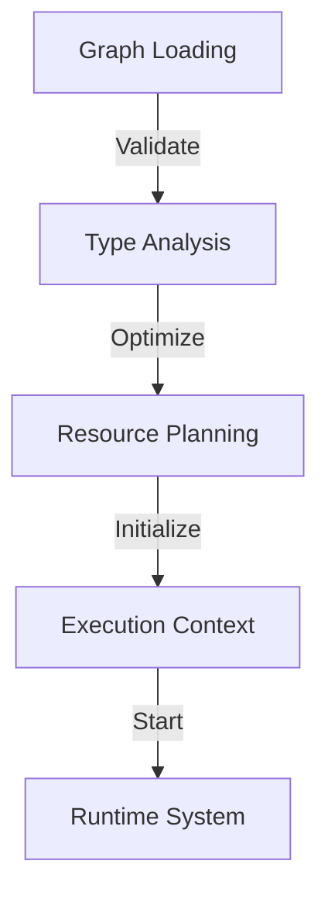
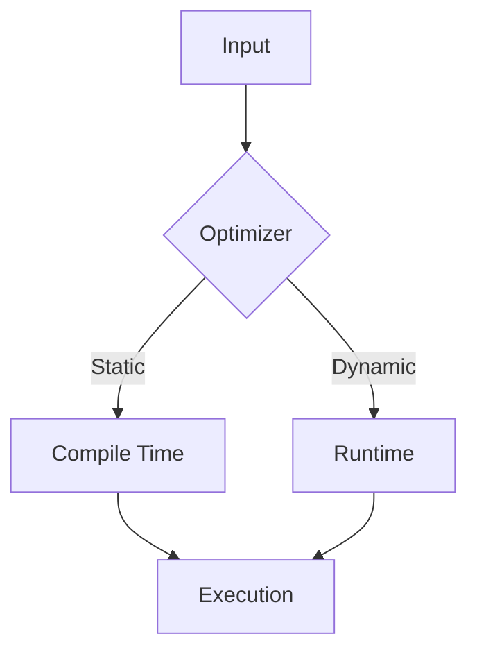

# Chain Graph: Execution System

## Introduction: The Future of AI Agent Orchestration

The Chain Graph execution system represents a groundbreaking approach to AI agent operation, combining visual programming's intuitive nature with enterprise-grade reliability. At its core, the system transforms visual representations of AI behavior into deterministic, mathematically verifiable execution patterns.

## Core Architecture

The execution system implements a hybrid architecture that synthesizes three powerful paradigms:

### 1. Dataflow Programming
The system treats AI behaviors as streams of data flowing through computational nodes. This approach enables:
- Real-time processing of information
- Natural parallelization of independent operations
- Clear visualization of data transformations
- Predictable execution patterns

### 2. Functional Composition
By treating nodes as composable functions, the system achieves:
- Deterministic behavior
- Easy testing and verification
- Reusable components
- Mathematical rigor in behavior definition

### 3. Actor Model
The incorporation of actor model principles provides:
- Isolated state management
- Message-based communication
- Resilient error handling
- Scalable concurrent execution

## Execution Pipeline

### 1. Graph Analysis Phase

Before execution begins, the system performs comprehensive analysis:



Key Analysis Components:
- **Topology Analysis**: Determines execution order and parallelization opportunities
- **Type Verification**: Ensures type safety across node connections
- **Resource Planning**: Calculates computational requirements
- **Dependency Resolution**: Maps data flow requirements
- **Optimization Planning**: Identifies performance improvement opportunities

### 2. Execution Context

The execution context provides a controlled environment for node operations:

```typescript
interface ExecutionContext {
    execution_id: string;        // Unique execution identifier
    agent: AgentProfile;         // Agent configuration
    chat_room: ChatRoomMeta;     // Communication context
    state: StateManager;         // Execution state
    resources: ResourceManager;   // Resource controller
}
```

The context ensures:
- Isolated execution environments
- Consistent state management
- Resource tracking and limitation
- Error boundary definition
- Performance monitoring

### 3. Real-time Execution

The system implements "Predictable Streaming" - a novel approach combining real-time operation with deterministic behavior:

```typescript
interface ExecutionStream<T> {
    main: AsyncIterator<T>;        // Primary data flow
    monitoring: MetricsStream;     // Performance metrics
    control: ControlChannel;       // Execution control
    state: StateManager;           // State handling
}
```

Key Features:
- **Deterministic Execution**: Guaranteed consistent results for identical inputs
- **State Observation**: Real-time visibility into execution state
- **Flow Control**: Sophisticated pause/resume capabilities
- **Resource Management**: Dynamic resource allocation

## State Management System

The system implements a sophisticated state management approach we call "Quantum State Management":

### 1. State Properties
- **Observable**: All state changes can be monitored in real-time
- **Recoverable**: States can be restored to any previous point
- **Verifiable**: State consistency can be mathematically proven
- **Portable**: States can be transferred between execution contexts

### 2. State Operations
The system provides atomic operations for state management:
- State capture and restoration
- Incremental state updates
- State verification
- State migration

## Performance Optimization

### 1. Execution Optimization
The system implements several levels of optimization:



- **Static Optimization**: Performed during graph analysis
- **Dynamic Optimization**: Applied during execution
- **Resource-Aware Scheduling**: Optimal resource utilization
- **Caching System**: Intelligent result caching

### 2. Resource Management
The system provides sophisticated resource control:
- Memory usage optimization
- Computation scheduling
- Network traffic management
- Cost optimization

## Enterprise Integration

### 1. Deployment Capabilities
The system supports various deployment scenarios:
- Containerized deployment
- Kubernetes orchestration
- Cloud-native operation
- On-premise installation

### 2. Monitoring and Management
Comprehensive monitoring capabilities include:
- Real-time execution tracking
- Performance metrics
- Resource utilization
- Cost analysis
- Error tracking

### 3. Security Features
Enterprise-grade security features:
- Role-based access control
- Execution isolation
- Audit logging
- Resource limitations

## Practical Benefits

### 1. Development Advantages
- **Rapid Prototyping**: Visual development enables quick iteration
- **Safe Experimentation**: Type-safe connections prevent runtime errors
- **Clear Visualization**: Complex logic becomes visually comprehensible
- **Team Collaboration**: Visual representation improves communication

### 2. Operational Benefits
- **Predictable Behavior**: Deterministic execution ensures consistency
- **Easy Maintenance**: Clear structure simplifies updates
- **Efficient Scaling**: Built-in support for horizontal scaling
- **Cost Control**: Integrated resource optimization

## Technical Foundation

The system is built on solid mathematical and computer science principles:

### 1. Mathematical Foundations
- **Category Theory**: Ensures sound composition principles
- **Type Theory**: Provides formal correctness guarantees
- **Graph Theory**: Enables optimal execution planning
- **Queue Theory**: Supports efficient resource scheduling

### 2. Implementation Principles
- **Immutable Data Flow**: Ensures predictable behavior
- **Functional Composition**: Enables reliable scaling
- **Actor Model**: Provides robust concurrency
- **Type Safety**: Prevents runtime errors

## Conclusion

The Chain Graph execution system represents a significant advancement in AI agent orchestration, combining theoretical rigor with practical utility. Its hybrid architecture enables sophisticated AI behaviors while maintaining enterprise-grade reliability and performance.

[Technical Note]
> "The system's multi-layered architecture ensures reliable execution while providing the flexibility needed for complex AI behaviors. Each layer - from graph analysis to runtime execution - is designed with both performance and safety in mind."

[Implementation Insight]
> "By combining visual programming with mathematical rigor, the system makes complex AI behavior development accessible while maintaining the reliability required for enterprise deployments."