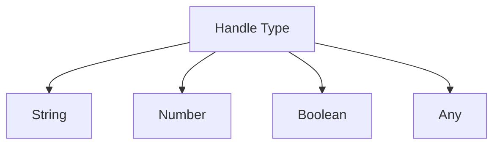
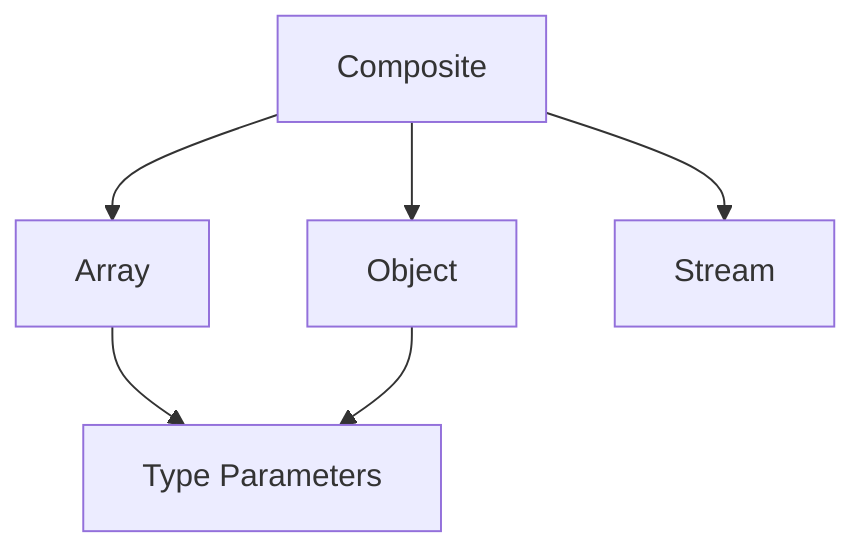
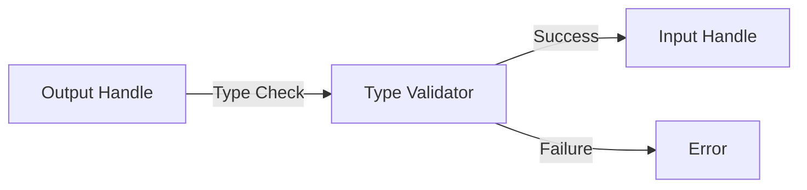

# Chain Graph: Handle System

## Handle Theory

Handles in Chain Graph represent typed channels through which data flows between nodes. They form a type system that ensures safe composition of computational elements.

## Type System

### 1. Primitive Types


### 2. Composite Types


### 3. Special Types

#### Stream Type
Represents potentially infinite data flows:
```typescript
type Stream<T> = AsyncIterator<T> & {
    buffer: T[]
    subscribers: Set<Subscriber>
}
```

#### Object Type
Structured data with schema validation:
```typescript
type ObjectHandle = {
    fields: Map<string, Handle>
    schema: Schema
    validators: Validator[]
}
```

## Handle Operations

### 1. Connection


### 2. Data Flow
- **Synchronous**: Direct value transfer
- **Asynchronous**: Stream-based transfer
- **Buffered**: Cached transfer
- **Broadcast**: Multi-recipient transfer

### 3. Type Coercion
Automatic type conversion where safe:
```typescript
type Coercion = {
    source: HandleType
    target: HandleType
    converter: (value: any) => Either<Error, any>
}
```