# Node System: The Computational Heart of Chain Graph

## Understanding Nodes

In Chain Graph, nodes represent the fundamental units of computation and logic. While handles manage data flow, nodes are where the actual work happens - they process data, make decisions, interact with external systems, and orchestrate AI behaviors. Think of nodes as specialized workers in a highly coordinated system, each with specific skills and responsibilities.

## The Nature of Nodes

### Categorical Foundation

At their core, nodes are morphisms between handle types - they transform data from one form to another in a mathematically rigorous way. This formal foundation ensures that:
- Transformations are predictable
- Operations are composable
- Behaviors are verifiable
- System states are trackable

### Node Identity

Every node maintains a distinct identity defined by:
- Unique identifier for system-wide tracking
- Type specification defining its capabilities
- Title for human readability
- Version tracking for state management

## Node Categories

Chain Graph implements a rich ecosystem of specialized nodes, each serving specific purposes in AI behavior orchestration:

### 1. Source Nodes
These nodes act as system entry points:

**Chat History Node**
- Provides access to conversation history
- Manages context windows
- Implements efficient retrieval
- Maintains conversation state

**Input Message Node**
- Processes incoming messages
- Validates input formats
- Extracts metadata
- Prepares data for processing

**Agent Profile Node**
- Manages agent identity
- Controls behavior parameters
- Handles configuration
- Maintains agent state

### 2. Processing Nodes

These nodes handle core computational tasks:

**LLM Call Node**
- Manages AI model interactions
- Handles token optimization
- Controls response streaming
- Manages resource usage

**Template Node**
- Processes text templates
- Handles variable substitution
- Manages formatting
- Controls output structure

### 3. Control Flow Nodes

These nodes manage execution flow:

**Branch Node**
- Implements conditional logic
- Manages decision points
- Controls flow splitting
- Handles condition evaluation

**Switch Node**
- Manages multiple paths
- Handles case selection
- Controls default behavior
- Manages flow merging

## Node Behavior

### State Management

Nodes implement sophisticated state management:

1. **Internal State**
- Value tracking
- Configuration state
- Processing state
- Error conditions

2. **External State**
- Connection status
- Resource usage
- Performance metrics
- Error propagation

### Operation Lifecycle

Each node follows a defined lifecycle:

1. **Initialization Phase**
```
Initialize → Validate Configuration → Prepare Resources
```

2. **Execution Phase**
```
Receive Input → Process Data → Produce Output → Update State
```

3. **Cleanup Phase**
```
Release Resources → Update Metrics → Signal Completion
```

## Node Interactions

### Handle Integration

Nodes interact with handles in a structured way:

1. **Input Handling**
- Type validation
- Value reception
- State synchronization
- Error checking

2. **Output Management**
- Result formatting
- Type compliance
- State updates
- Error propagation

### System Integration

Nodes integrate with various system components:

1. **Execution Engine**
- Resource allocation
- Schedule management
- Performance monitoring
- Error handling

2. **Knowledge System**
- Context access
- Knowledge retrieval
- State persistence
- Cache management

## Specialized Node Types

### 1. Knowledge Processing Nodes

These nodes interface with the knowledge system:

**Search QA Node**
- Performs semantic search
- Manages relevance scoring
- Handles context integration
- Controls response formatting

**Reference List Node**
- Manages citations
- Handles reference tracking
- Controls source attribution
- Manages document links

### 2. Communication Nodes

These nodes handle external interactions:

**Message Nodes**
- Manage message creation
- Handle message updates
- Control message flow
- Manage response timing

**Stream Nodes**
- Handle real-time data
- Manage data flow
- Control backpressure
- Handle interruptions

## Node Composition: Building Complex AI Behaviors

Node composition is how Chain Graph transforms simple components into sophisticated AI behaviors. Understanding composition patterns is key to creating effective and maintainable AI systems.

### Fundamental Composition Patterns

#### 1. Sequential Processing
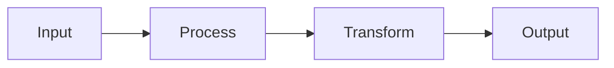

The simplest yet powerful pattern. Used for:
- Step-by-step data transformation
- Progressive refinement of responses
- Ordered processing pipelines
- Sequential validation chains

**Real Example**: Multi-stage content generation
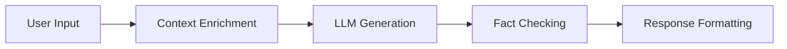

#### 2. Parallel Processing
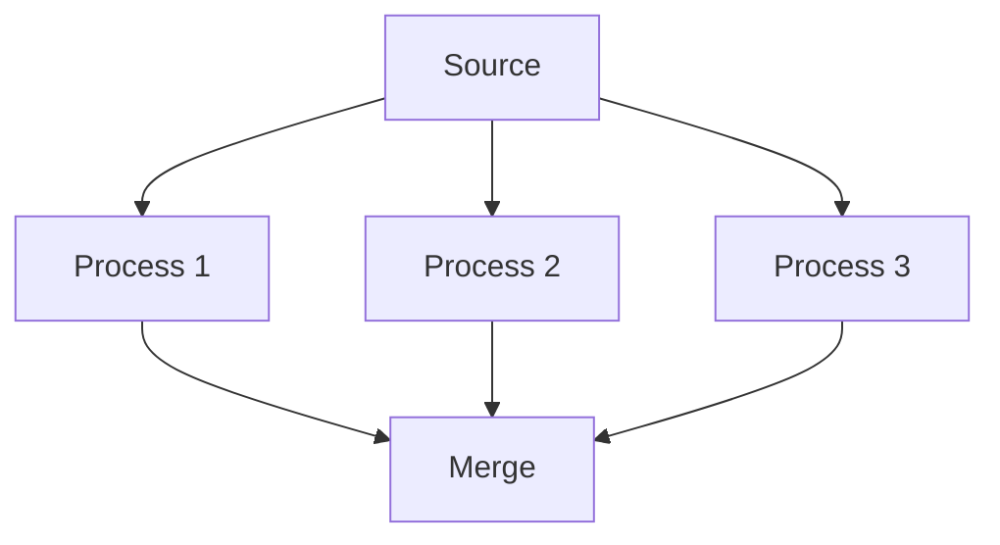

Enables concurrent operations for:
- Independent data processing
- Multi-model inference
- Parallel data validation
- Concurrent API calls

**Real Example**: Multi-aspect analysis
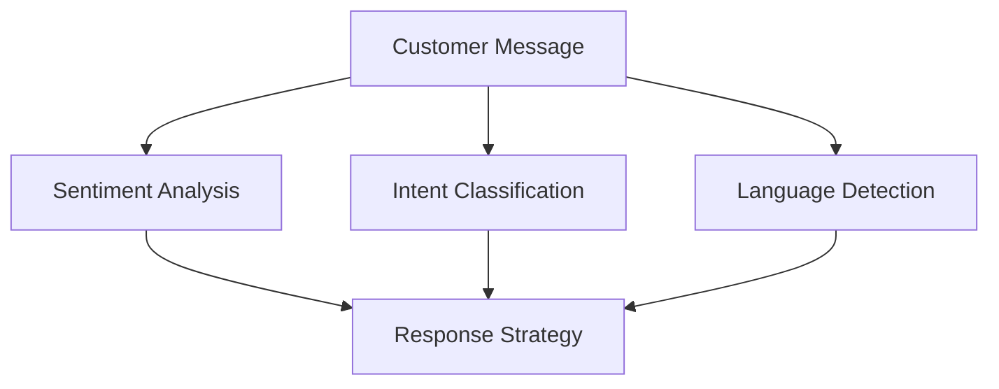

#### 3. Branching and Merging
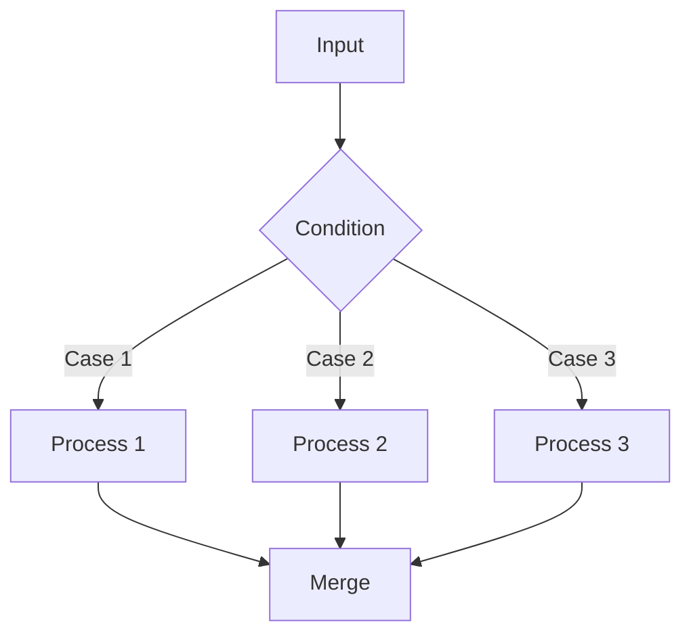

Used for:
- Conditional processing
- Content routing
- Error handling
- State management

**Real Example**: Multi-language Support
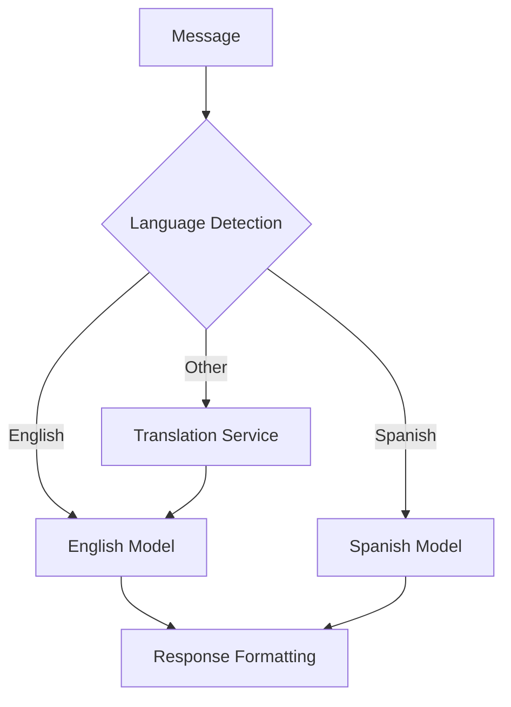

### Advanced Composition Patterns

#### 1. Pipeline with Validation
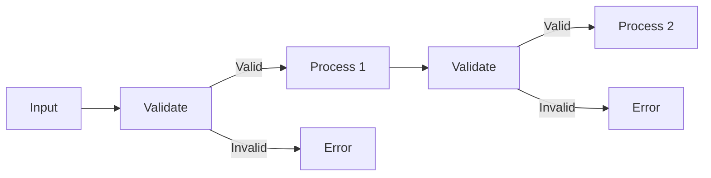

Benefits:
- Early error detection
- Data quality assurance
- Process integrity
- Clear error handling

**Use Case**: Financial Transaction Processing
- Input validation
- Balance checking
- Transaction processing
- Confirmation generation

#### 2. Dynamic Routing
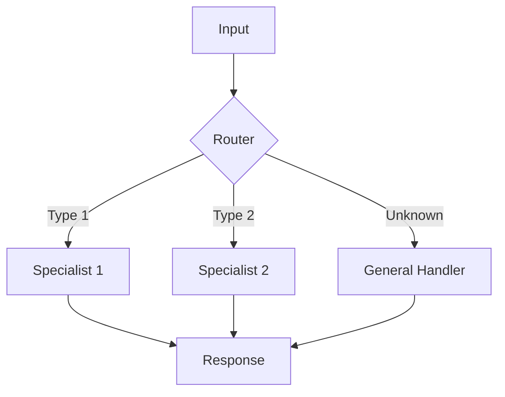

Perfect for:
- Content-based routing
- Load balancing
- Specialized processing
- Fallback handling

**Use Case**: Customer Support System
- Technical queries to tech support
- Billing issues to finance team
- General queries to AI assistant

#### 3. Aggregation Pattern
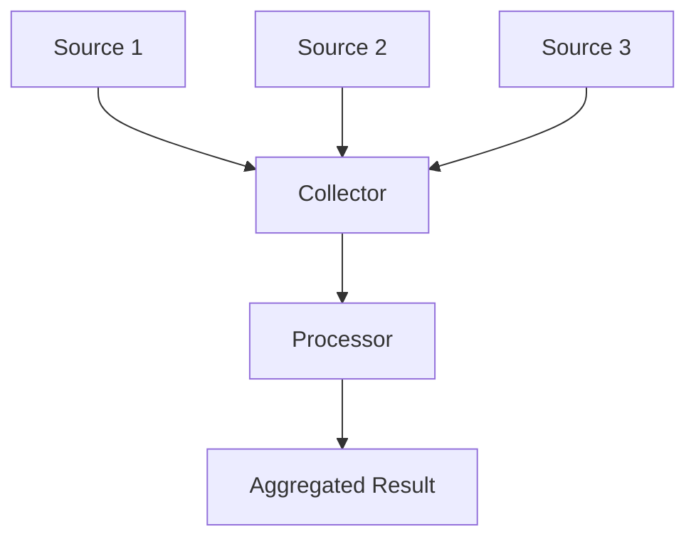

Useful for:
- Data consolidation
- Multi-source processing
- Information synthesis
- Report generation

**Use Case**: Market Analysis
- Price data collection
- News aggregation
- Sentiment analysis
- Combined reporting

#### 4. State Machine Pattern
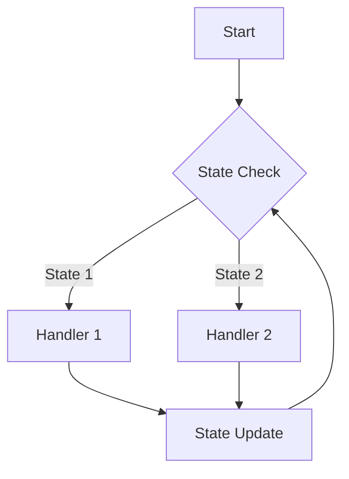

Essential for:
- Conversation management
- Process flow control
- State tracking
- Transaction management

**Use Case**: Multi-turn Dialogue
- Context maintenance
- State progression
- History tracking
- Flow management

### Complex Real-World Patterns

#### 1. Knowledge-Enhanced Response Generation
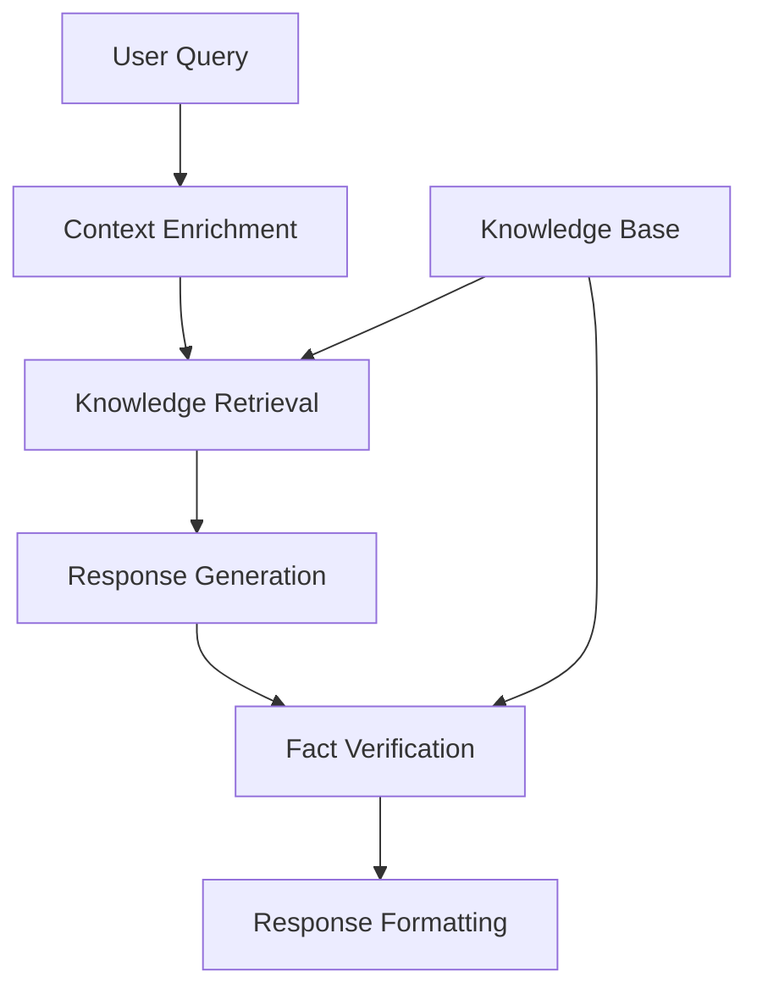

This pattern combines:
- Context awareness
- Knowledge integration
- Fact checking
- Response quality control

#### 2. Multi-Agent Collaboration
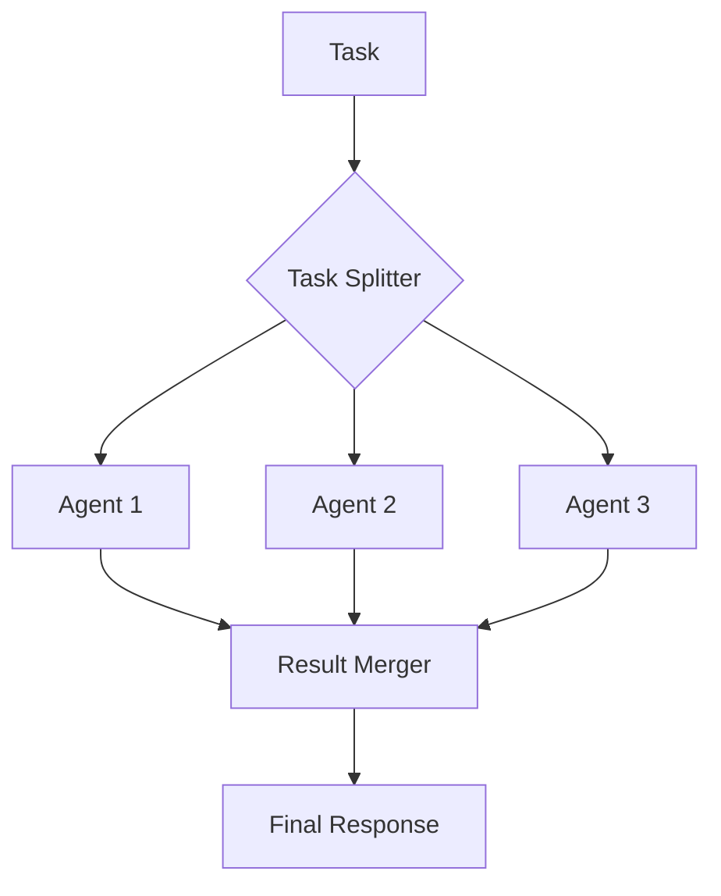

Enables:
- Task distribution
- Parallel processing
- Expertise combination
- Result synthesis

[Pattern Note]
> "These composition patterns provide templates for solving common AI behavior challenges while maintaining system reliability and clarity."

[Implementation Note]
> "Each pattern can be customized and combined to create sophisticated AI behaviors while preserving system maintainability and performance."


## Real-World Applications

### Customer Service Automation

A typical customer service flow might involve:
1. Input Node processes customer message
2. Analysis Node determines intent
3. Knowledge Node retrieves relevant information
4. LLM Node generates response
5. Output Node formats and sends reply

### Document Processing

Document handling often includes:
1. Input Node receives document
2. Processing Node extracts content
3. Analysis Node categorizes information
4. Storage Node manages persistence
5. Reference Node maintains citations

## Implementation Considerations

### 1. Performance Optimization

Nodes implement several optimization strategies:
- Lazy evaluation when possible
- Resource pooling for efficiency
- Cache utilization
- Parallel processing where appropriate

### 2. Error Management

Robust error handling includes:
- Graceful degradation
- Error recovery
- State restoration
- Error propagation control

[Technical Insight]
> "Nodes represent the computational building blocks of Chain Graph, each implementing specific behaviors while maintaining system-wide consistency and reliability."

[Architectural Note]
> "The node system's modular design enables complex AI behaviors to be built from simple, reliable components while maintaining mathematical rigor."

[Implementation Impact]
> "By encapsulating specific functionalities while maintaining strict interfaces, nodes enable the creation of sophisticated AI behaviors through visual programming."