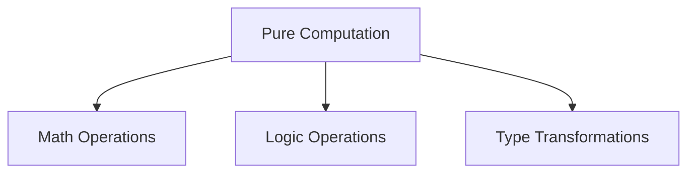
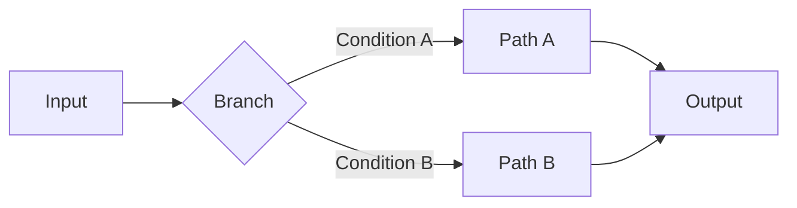

# Chain Graph: Node System Architecture

## Conceptual Overview

The node system in Chain Graph can be understood as a category where objects are computational units (nodes) and morphisms are typed connections (handles). This mathematical foundation ensures compositional correctness and enables formal verification of agent behaviors.

## Node Types Hierarchy

### 1. Foundation Nodes
These nodes represent pure functions in our system - given the same input, they always produce the same output.



### 2. Effectful Nodes
These nodes interact with external systems and maintain state:

- **LLM Nodes**: Interact with AI models
- **Database Nodes**: Handle persistent storage
- **Integration Nodes**: Communicate with external platforms

### 3. Control Flow Nodes
These nodes direct the flow of computation, similar to categorical coproducts:



## Node Execution Model

Nodes operate within a monadic context that handles:
- Asynchronous operations
- Error handling
- State management
- Side effect tracking

```typescript
type NodeExecution<T> = Context => Promise<Either<Error, T>>
```

## Node Properties

1. **Identity**
- Unique identifier
- Type signature
- Version information
- Metadata

2. **State**
- Internal configuration
- Runtime cache
- Performance metrics
- Error state

3. **Interfaces**
- Input handles
- Output handles
- Configuration ports
- Event emitters
