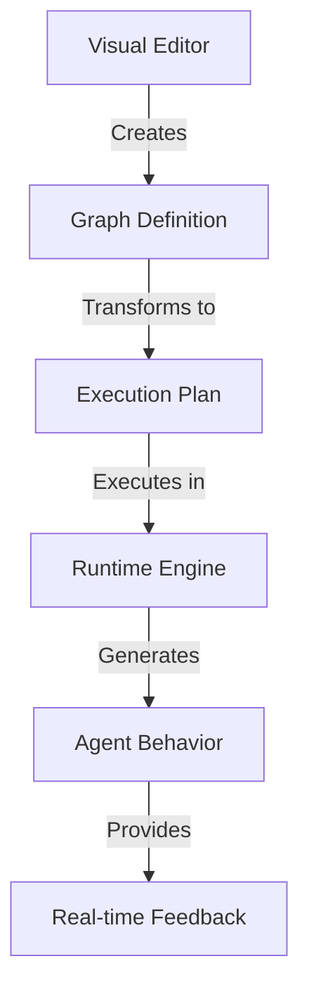
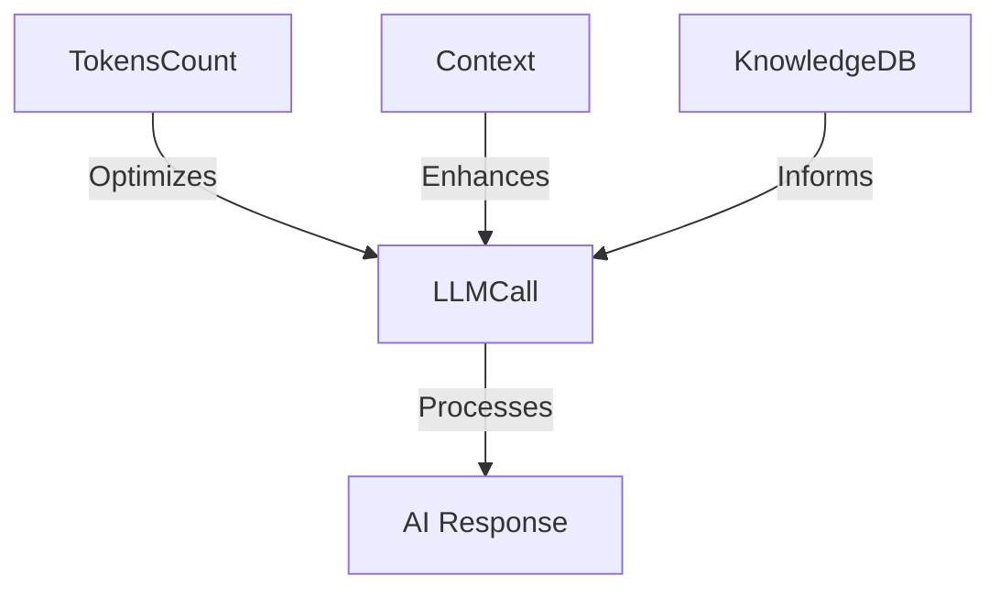
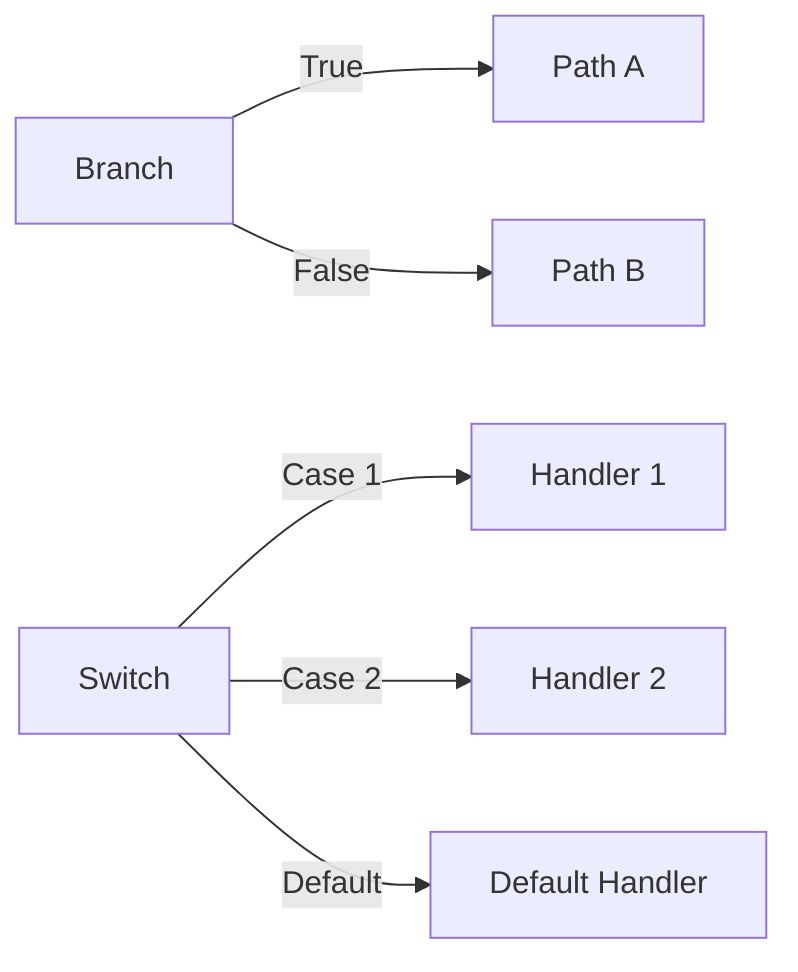
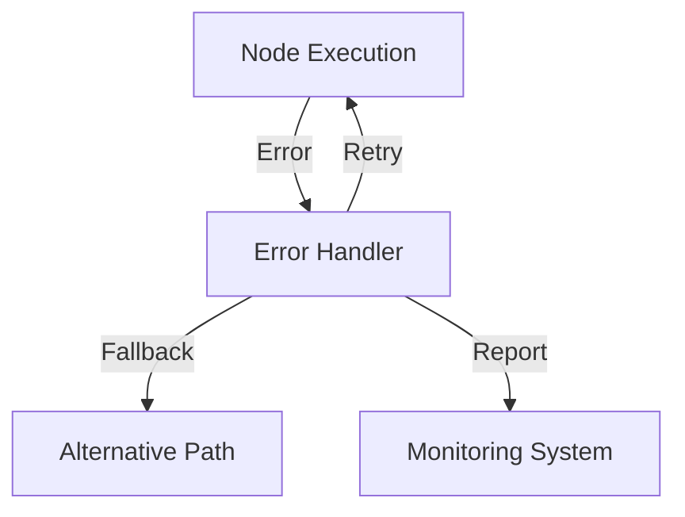
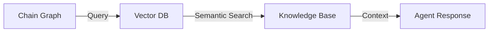

# Chain Graph System: The Future of AI Agent Development

## Revolutionary Approach to AI Programming

Chain Graph System represents a paradigm shift in how AI agents are created and managed. It transforms complex AI programming into an intuitive visual experience while maintaining enterprise-grade capabilities.


## Core Technology Overview

### Visual Programming Architecture


### Execution Model

The Chain Graph system implements a sophisticated execution model:

1. **Graph Analysis**
    - Topological sorting of nodes
    - Dependency resolution
    - Cycle detection
    - Parallel execution optimization

2. **Data Flow**
   ```mermaid
   graph LR
       A[Input Handle] -->|Type-safe Connection| B[Processing]
       B -->|Stream/Value| C[Output Handle]
       C -->|Connection| D[Next Node]
   ```

3. **State Management**
    - Persistent state across executions
    - Context preservation
    - Variable scoping
    - Real-time state updates

## Node System Architecture

### 1. Handle Types System
```typescript
interface Handle {
    id: HandleID
    type: HandleType
    direction: 'input' | 'output'
    value: HandleValue
    connections: Connection[]
}

type HandleType =
    | 'string'
    | 'number'
    | 'boolean'
    | 'array'
    | 'object'
    | 'stream'
    | 'any'
```

### 2. Core Node Categories

#### Source Nodes
- **ChatHistory**: Access and analyze conversation history
- **InputMessage**: Process incoming messages with metadata
- **AgentProfile**: Manage agent characteristics and behavior
- **ChatMeta**: Handle chat-specific metadata and configuration
- **DexScreener**: Integration with financial data

#### AI Processing Nodes


- **LLMCall**: Advanced LLM integration with streaming
- **TokensCount**: Token optimization and cost management
- **TemplateEngine**: Dynamic prompt generation
- **KnowledgeDB**: Semantic search and context management

#### Control Flow Nodes


#### Integration Nodes
- Platform-specific message handling
- Multi-channel communication
- Format adaptation
- Response optimization

## Advanced Features

### 1. Stream Processing
```typescript
class StreamHandler {
    async process(input: Stream): Promise<void> {
        for await (const chunk of input) {
            // Real-time processing
            await this.handleChunk(chunk)
        }
    }
}
```

### 2. Dynamic Graph Modification
- Runtime graph updates
- Hot-reload capability
- Dynamic node addition/removal
- State preservation during updates

### 3. Error Handling and Recovery


### 4. Possible performance Optimization
- Parallel execution of independent nodes
- Caching system for repeated operations
- Resource usage monitoring
- Automatic scaling based on load

## Enterprise Integration

### 1. Knowledge Database Integration


### 2. Multi-Agent Coordination
- Inter-agent communication
- Shared knowledge base
- Role-based behavior
- Task distribution

### 3. Security and Compliance
- Access control per node
- Audit logging
- Data encryption
- Compliance monitoring

## Development Experience

### 1. Node Development
```typescript
class CustomNode extends BaseNode {
    async execute(context: ExecutionContext): Promise<HandleValue[]> {
        // Custom logic implementation
        const input = this.getInput('main')
        const processed = await this.process(input)
        return this.setOutput('result', processed)
    }
}
```

### 2. Testing and Debugging
- Visual debugging tools
- Node-level testing
- Graph validation
- Performance profiling

### 3. Deployment and Scaling
- Docker container support
- Kubernetes orchestration
- Automatic scaling
- Load balancing

## Future Roadmap

1. **Enhanced AI Capabilities**
    - Multi-model support
    - Custom model integration
    - Advanced reasoning systems

2. **Extended Integration**
    - Additional platform support
    - Enterprise system connectors
    - Custom protocol handlers

3. **Advanced Features**
    - Visual graph analytics
    - AI-assisted graph creation
    - Automated optimization

4. **Enterprise Tools**
    - Advanced monitoring
    - Custom node marketplace
    - Team collaboration features