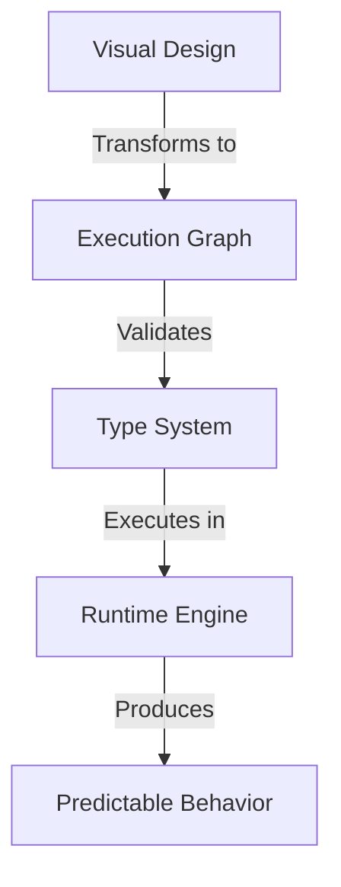
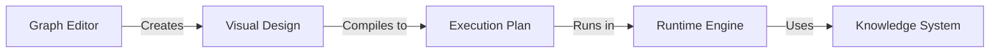

# Chain Graph System: Transforming AI Agent Development

## The Vision

Chain Graph represents a paradigm shift in AI agent development, bridging the gap between simple chatbots and sophisticated AI systems. Instead of traditional programming approaches, Chain Graph introduces a visual, mathematically rigorous way to design and deploy AI behaviors at enterprise scale.

## Core Innovation

### Visual Programming with Mathematical Rigor

Chain Graph combines two seemingly opposing concepts:
1. **Visual Simplicity**: Making AI development accessible through intuitive visual programming
2. **Mathematical Rigor**: Ensuring enterprise-grade reliability through formal mathematical foundations

This unique combination enables:
- Rapid development of complex AI behaviors
- Guaranteed type safety and execution reliability
- Clear visualization of complex logic
- Mathematical verification of system properties

### The Power of Graph-Based Design

Unlike traditional chatbot frameworks that rely on simple decision trees or basic prompt engineering, Chain Graph enables:
- Complex multi-step reasoning
- Sophisticated state management
- Type-safe data transformations
- Parallel processing capabilities

## Impact on AI Development

### 1. Development Experience

Traditional AI Development vs Chain Graph:

| Aspect | Traditional Approach | Chain Graph |
|--------|---------------------|-------------|
| Development Speed | Slow, code-heavy | Rapid, visual |
| Error Prevention | Runtime detection | Design-time prevention |
| System Understanding | Complex code review | Clear visual representation |
| Maintenance | Difficult refactoring | Visual component management |

### 2. Enterprise Capabilities

Chain Graph enables enterprise-grade AI deployments through:

1. **Reliability**
   - Type-safe operations
   - Predictable behavior
   - Error boundaries
   - State tracking

2. **Scalability**
   - Parallel execution
   - Resource optimization
   - Load distribution
   - Horizontal scaling

3. **Maintainability**
   - Visual debugging
   - Clear dependencies
   - Component reuse
   - Version control

## System Architecture

### 1. Core Components

Each component serves a crucial role:
- **Graph Editor**: Visual environment for AI behavior design
- **Execution Engine**: High-performance runtime system
- **Knowledge System**: Integrated vector-based knowledge management
- **Type System**: Mathematical guarantee of operation safety

### 2. Knowledge Integration

Chain Graph's unique architecture enables seamless integration with knowledge systems:
- Vector-based semantic search
- Context-aware processing
- Dynamic knowledge updates
- Efficient retrieval mechanisms

## Real-World Applications

### 1. Enterprise Virtual Assistants

Chain Graph enables sophisticated assistant behavior:
- Complex multi-turn dialogues
- Context-aware responses
- Knowledge-based reasoning
- Multi-domain expertise

### 2. Financial Services

Critical capabilities for financial applications:
- Audit-ready operations
- Compliant processes
- Transaction safety
- Decision traceability

### 3. Healthcare Systems

Essential features for healthcare:
- Privacy-compliant processing
- Reliable decision support
- Traceable recommendations
- Safe operation boundaries

## Future-Proof Architecture

Chain Graph is designed for evolution:

1. **Extensibility**
   - New node types
   - Custom integrations
   - Protocol adaptations
   - Model updates

2. **Adaptability**
   - Framework independence
   - Model agnostic
   - Protocol flexible
   - Integration ready

## Competitive Advantage

Chain Graph provides unique benefits:

1. **Development Speed**
   - Visual programming accelerates development
   - Component reuse increases efficiency
   - Clear visualization improves understanding
   - Type safety reduces errors

2. **Enterprise Reliability**
   - Mathematical foundations ensure correctness
   - Type system prevents runtime errors
   - State management enables recovery
   - Execution engine ensures performance

3. **Operational Excellence**
   - Clear behavior visualization
   - Easy system maintenance
   - Efficient troubleshooting
   - Simple scaling

## Business Impact

Chain Graph transforms AI development by:

1. **Reducing Costs**
   - Faster development cycles
   - Fewer runtime errors
   - Easier maintenance
   - Efficient scaling

2. **Improving Quality**
   - Predictable behavior
   - Type-safe operations
   - Clear visualization
   - Easy verification

3. **Enabling Innovation**
   - Rapid prototyping
   - Easy experimentation
   - Component reuse
   - Clear architecture

[Technical Note]
> "Chain Graph's combination of visual programming and mathematical rigor enables enterprise-grade AI development while maintaining development speed and system reliability."

[Business Value]
> "By transforming complex AI development into a visual, mathematically verified process, Chain Graph enables rapid development of sophisticated AI systems while ensuring enterprise-grade reliability."