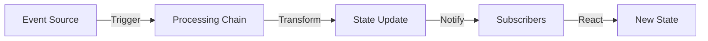
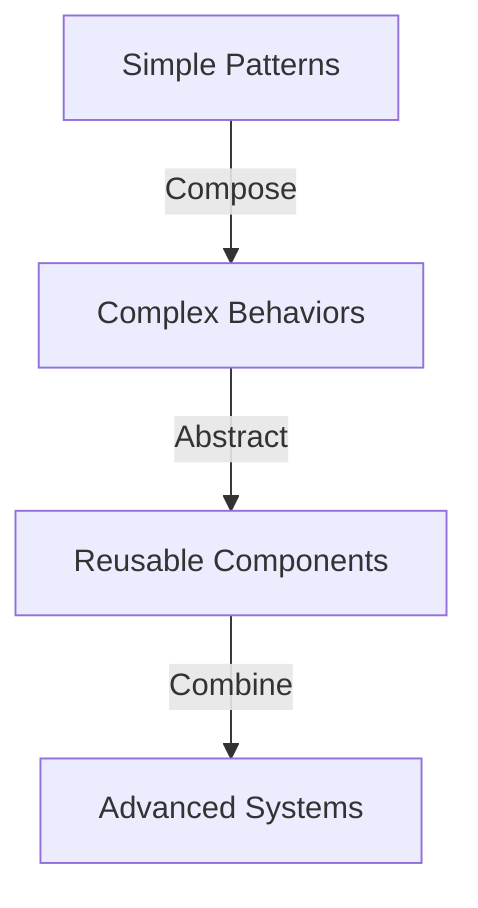
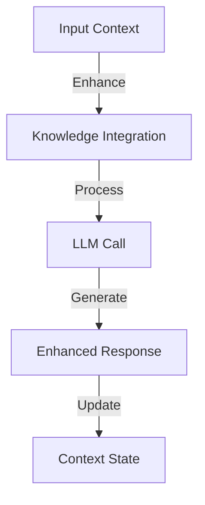
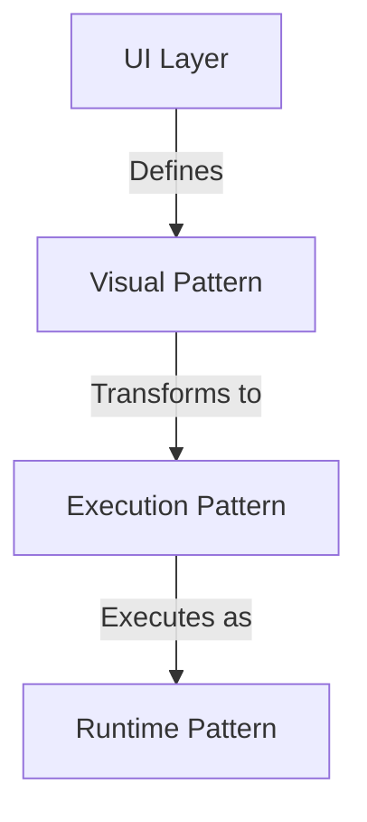
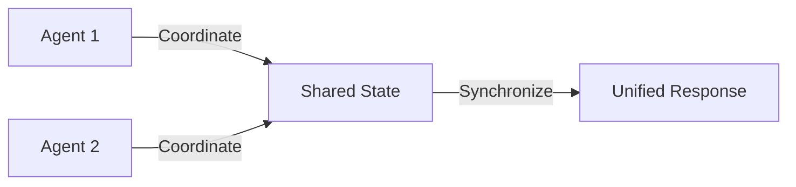

# Chain Graph: Design Patterns and Best Practices

## Computational Patterns

Chain Graph implements several powerful computational patterns that enable sophisticated AI behaviors while maintaining simplicity and clarity.

### 1. Reactive Patterns



#### Event Processing
- **Pattern**: Event → Process → React
- **Implementation**: Stream-based processing
- **Advantage**: Real-time responsiveness
- **Use Case**: Chat interactions, Market data processing

#### State Management
- **Pattern**: Update → Validate → Broadcast
- **Implementation**: Atomic state transitions
- **Advantage**: Consistency guarantee
- **Use Case**: Multi-agent coordination

### 2. Compositional Patterns



#### Function Composition
- Linear processing chains
- Parallel processing paths
- Feedback loops
- Conditional branching

#### Data Transformation
- Stream processing
- Batch processing
- Real-time analysis
- Historical analysis

### 3. AI Patterns

#### Context Management


#### Knowledge Integration
- Dynamic context loading
- Semantic search
- Relevance filtering
- Context pruning

## Architectural Patterns

### 1. Modular Design

Each Chain Graph can be viewed as a composition of smaller, reusable patterns:

```typescript
type Pattern = {
    nodes: Node[]
    connections: Connection[]
    interface: Interface
    behavior: Behavior
}
```

### 2. Layer Separation



## Advanced Usage Patterns

### 1. Multi-Agent Coordination



### 2. Knowledge Flow Patterns

- **Query Pattern**: Search → Filter → Rank → Present
- **Learning Pattern**: Observe → Analyze → Store → Apply
- **Teaching Pattern**: Input → Validate → Store → Confirm