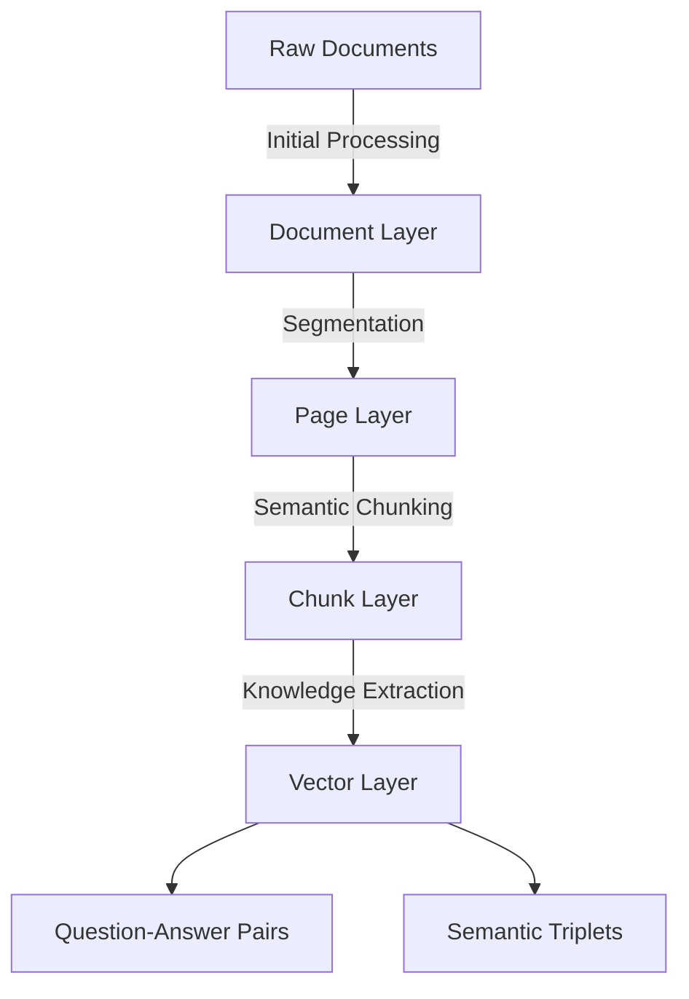
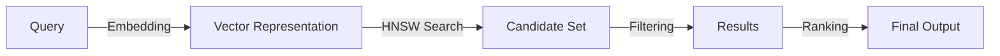
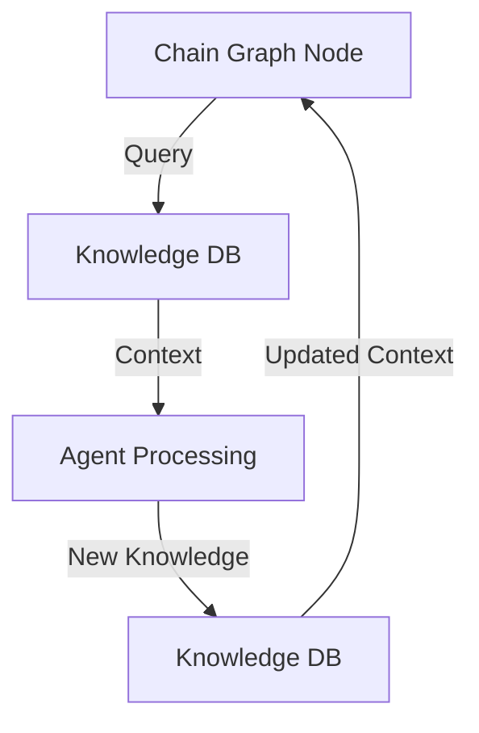

# Knowledge Database System

## Technical Overview

The Knowledge Database (KDB) is a specialized system for processing, storing, and retrieving knowledge using vector semantics and mathematical similarity models. It serves as the foundation for AI agent intelligence in the Chain Graph system by providing contextual knowledge and semantic search capabilities.

## Core Architecture

### Document Processing Pipeline

The system implements a hierarchical document processing architecture:

Key Aspects:
- **Document Layer**: Handles metadata, versioning, and document organization
- **Page Layer**: Manages logical document segmentation
- **Chunk Layer**: Creates optimal semantic units with overlap
- **Vector Layer**: Generates and indexes 1536-dimensional embeddings

### Vector Processing System

The core of KDB utilizes high-dimensional vector space for semantic operations:

- Distance Metric: Cosine Similarity
- Index Type: HNSW (Hierarchical Navigable Small World)
- Storage: PostgreSQL with pgvector extension

### Integration with Chain Graph

The KDB serves as a knowledge backend for AI agents in the Chain Graph system:

1. **Context Retrieval**
    - Agents query KDB using semantic search
    - Multiple weighted queries support
    - Time-decay relevance weighting
    - Context window optimization

2. **Knowledge Processing**
    - Automatic document segmentation
    - Semantic chunk generation
    - QA pair extraction
    - Knowledge graph building

3. **Agent Memory**
    - Long-term knowledge storage
    - Semantic similarity search
    - Context-aware filtering
    - Transaction-safe updates

## Query System Architecture

### Search Implementation

The KDB implements a mathematical similarity-based search system:

Components:
- Vector similarity calculation
- Multi-query processing
- Result set optimization
- Cost-based execution planning

### Performance Optimizations

1. **Query Processing**
    - Parallel vector operations
    - Batch embedding generation
    - Query result caching
    - Cost-based query planning

2. **Storage Optimizations**
    - HNSW index for vectors
    - B-tree indexes for metadata
    - Optimized chunk size
    - Smart overlap calculation

3. **Resource Management**
    - Token usage tracking
    - Embedding cost optimization
    - Query cost estimation
    - Resource allocation control

## Chain Graph Integration

### Knowledge Flow

### Agent Knowledge Processing

1. **Context Building**
    - Semantic query generation
    - Context window management
    - Relevance scoring
    - Token budget optimization

2. **Knowledge Application**
    - Context integration
    - Answer generation
    - Knowledge verification
    - Response optimization

3. **Memory Management**
    - Short-term context
    - Long-term knowledge
    - Semantic deduplication
    - Priority-based storage

## Technical Specifications

### Core System
- Database: PostgreSQL + pgvector
- Index Type: HNSW
- Distance Metric: Cosine Similarity

### Processing Pipeline
- Document Processing: Parallel pipeline
- Chunking: Overlapping semantic units
- Embedding: Batch processing
- Query: Parallel vector operations

### Integration
- API: GraphQL
- Real-time: WebSocket support
- Transactions: ACID compliance
- Security: Role-based access

## Use in Agent Architecture

The KDB enables Chain Graph agents to:
1. Access and utilize large knowledge bases
2. Maintain context across interactions
3. Build and update knowledge representations
4. Share knowledge between agents
5. Optimize response generation

## System Benefits

### Technical Advantages
- Mathematically sound similarity search
- Efficient vector operations
- Transaction-safe knowledge updates
- Scalable architecture

### Agent Capabilities
- Context-aware responses
- Knowledge persistence
- Efficient information retrieval
- Cross-document understanding

[Key Quote for Pitch]
> "The Knowledge Database system combines vector semantics with traditional database capabilities to provide AI agents with efficient access to large-scale knowledge bases while maintaining mathematical rigor in similarity calculations and knowledge retrieval."
 

>"The integration of HNSW vector search with traditional database features enables efficient semantic operations while maintaining ACID compliance and transaction safety."

> "The hierarchical processing pipeline transforms documents into optimized vector representations, enabling efficient semantic search and knowledge retrieval for AI agents."