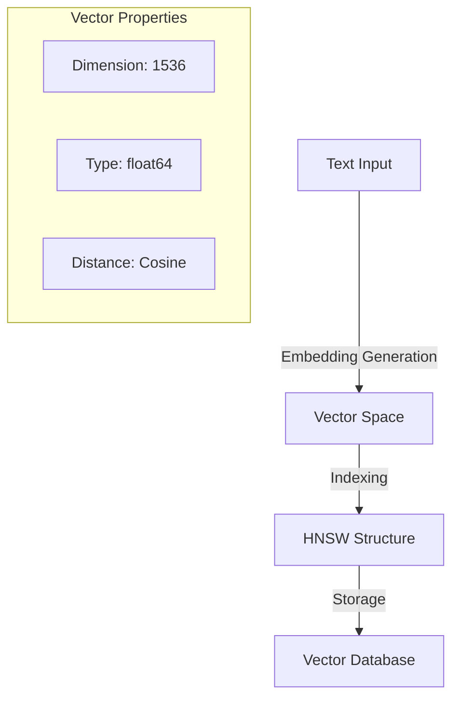
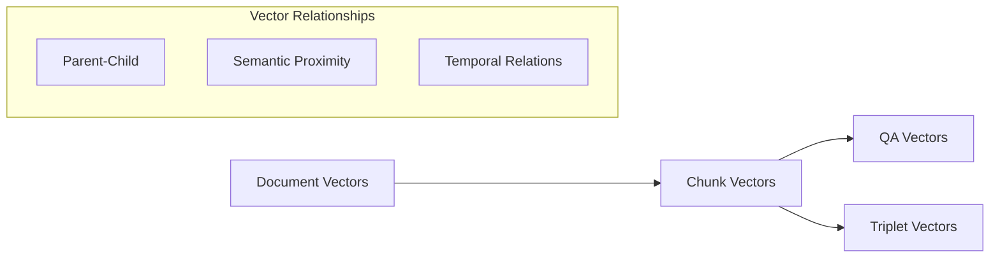
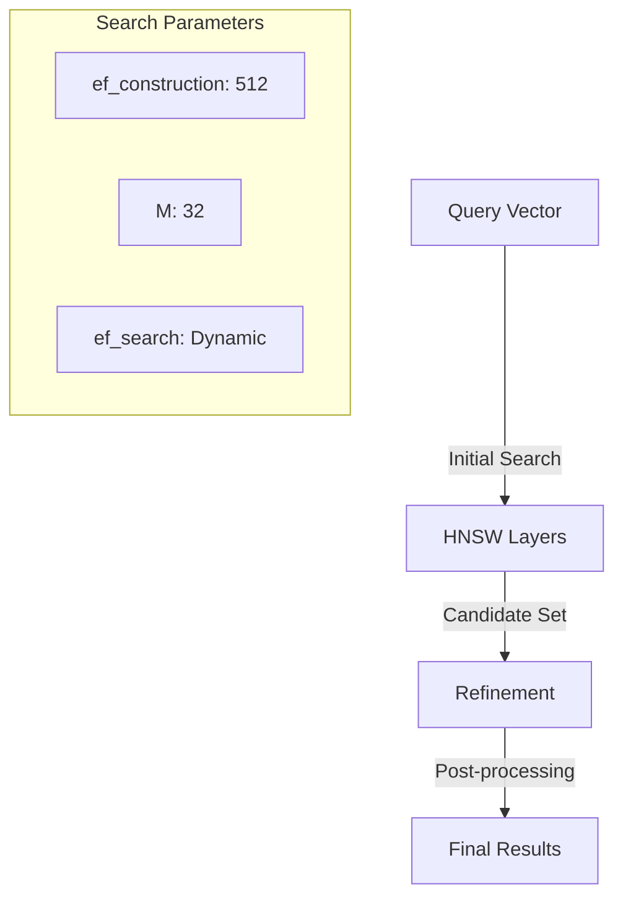
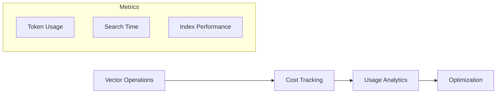
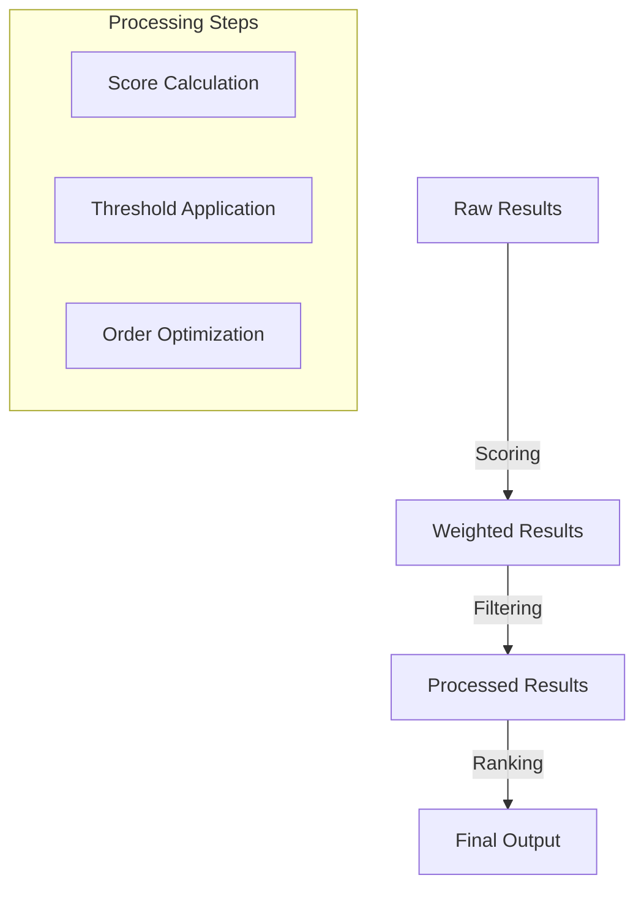
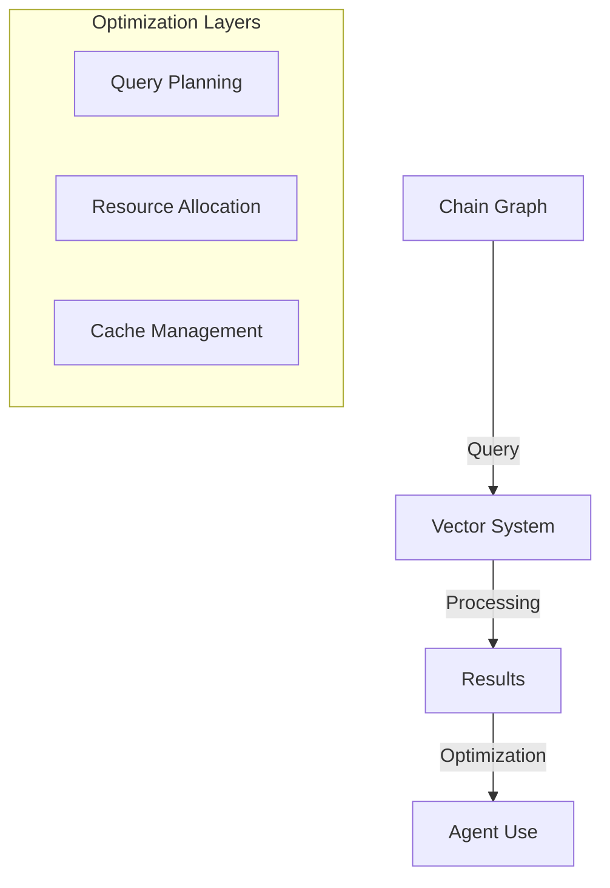

# Vector Processing and Semantic Search System

## Vector Processing Architecture

The Knowledge Database implements a sophisticated vector processing system that forms the foundation of semantic understanding and retrieval. The system utilizes high-dimensional vector spaces to represent and process knowledge.

### Vector Implementation

## Embedding Processing Pipeline

### 1. Generation Layer
The system maintains several embedding types:
- Document embeddings
- Chunk embeddings
- Question embeddings
- Answer embeddings

Each type is optimized for its specific use case while maintaining mathematical compatibility in the vector space.

### 2. Storage Organization

The vector storage system implements a hierarchical structure:

## Search Implementation

### 1. HNSW Search Architecture

The Hierarchical Navigable Small World (HNSW) implementation provides:
- Logarithmic search complexity
- Configurable accuracy/speed tradeoff
- Efficient approximate nearest neighbor search
- Dynamic index updates

### 2. Search Optimization

## Cost Optimization System

### 1. Resource Management

The system implements several cost optimization strategies:

- **Embedding Generation**
    - Batch processing
    - Caching mechanisms
    - Token optimization
    - Request batching

- **Search Optimization**
    - Query planning
    - Result caching
    - Index optimization
    - Resource allocation

### 2. Performance Metrics

## Query Processing

### 1. Multi-Query System

The system supports complex query operations:

- Multiple query vectors
- Query weight assignments
- Time decay functions
- Context-based filtering

### 2. Result Processing

## Technical Implementation Details

### 1. Vector Operations

Core vector operations include:
- Cosine similarity calculation
- Vector normalization
- Batch processing
- Dimension verification

### 2. Index Management

The HNSW index implementation provides:
- Dynamic updates
- Concurrent access
- Performance optimization
- Resource management

[Technical Quote]
> "The vector processing system implements a mathematically rigorous approach to semantic search, utilizing 1536-dimensional vector spaces and optimized HNSW indexing for efficient similarity calculations."

[Architecture Note]
> "The hierarchical organization of vectors, from document level to individual QA pairs, enables efficient semantic search while maintaining relationships between different knowledge components."

[Performance Insight]
> "Cost optimization is achieved through careful management of embedding generation, storage, and search operations, with continuous monitoring and adjustment of system parameters."

## Integration with Chain Graph

### 1. Knowledge Access

Chain Graph nodes access the vector system through:
- Direct vector queries
- Semantic similarity search
- Context-based filtering
- Multi-vector operations

### 2. Knowledge Updates

The system supports:
- Atomic vector updates
- Transaction-safe operations
- Concurrent access
- Version management

### 3. Performance Optimization

## Future Development Areas

### 1. Technical Enhancements
- Improved vector compression
- Enhanced index structures
- Advanced similarity metrics
- Optimization algorithms

### 2. Integration Extensions
- Additional vector types
- Enhanced search capabilities
- Improved cost optimization
- Advanced caching strategies